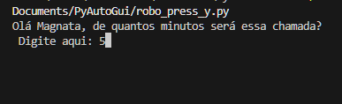
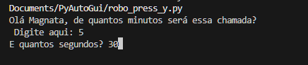
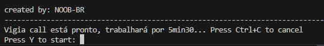
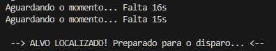
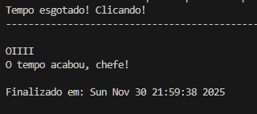

# Vigia Callzinha 🎯

Seu porteiro virtual que gerencia calls automaticamente usando visão computacional.

## ⚠️ AVISO IMPORTANTE
**Este código é para fins educacionais.** Use por sua conta e risco.

## 🎥 Como Funciona - Passo a Passo Visual

### 1. Configure o tempo da call
Digite os minutos e segundos desejados:




### 2. Inicie o vigia
Aperte Y (ou Enter) para começar:




### 3. Relaxe e faça sua call
O vigia monitora automaticamente. Nos últimos 15 segundos, ele procura seu app:


### 4. Detecção automática
Quando localiza o app, prepara o "disparo":



### 5. Sequência de desligamento
- **Passo 1:** Clica no app (se necessário)
- **Passo 2:** Clica no botão intermediário (se aplicável):


- **Passo 3:** Clica para desligar:


### 6. Call finalizada
Confirmação de término:



## 🧪 Teste Recomendado
**Faça um teste com 0 minutos e 20 segundos** antes de usar em calls importantes!

## 🛠️ Pré-requisitos Técnicos
```bash
pip install pyautogui opencv-python
