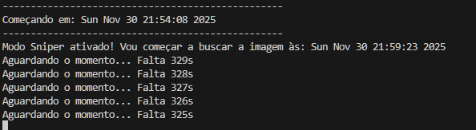

# Vigia Callzinha 🎯

Seu porteiro do zap que gerencia calls automaticamente usando visão computacional.

## ⚠️ AVISO IMPORTANTE
**Este código é para fins educacionais.** Use por sua conta e risco.

## 🎥 Como Funciona - Passo a Passo Visual

### 1. Configure o tempo da call
Digite os minutos e segundos desejados:


### 2. Inicie o vigia
Aperte Y (ou Enter) para começar:




### 3. Relaxe e faça sua call
O vigia monitora automaticamente. Nos últimos 15 segundos, ele procura seu app:


### 4. Detecção automática
Quando localiza o app, prepara o "disparo":


### 5. Sequência de desligamento
- **Passo 1:** Clica no app (se necessário)
- **Passo 2:** Clica no botão intermediário (se aplicável):


- **Passo 3:** Clica para desligar:


### 6. Call finalizada
Confirmação de término:


## 🧪 Teste Recomendado
**Faça um teste com 0 minutos e 20 segundos** antes de usar em calls importantes!

## 🛠️ Pré-requisitos Técnicos
📥 Instalação Necessária
1. Tenha Python instalado

Download: python.org

2. Baixe o arquivo do robô

Faça download do robo_press_y.py

```bash
pip install pyautogui opencv-python

-----------
## 💡 Sugestões e Melhorias
Quer suporte para outro app (Zoom, Teams, Discord)? Encontrou um bug?
Não guarde para você!

👉 **[Abra uma Issue aqui](https://github.com/noob-br/vigia-callzinha/issues)** e me conte o que você precisa.
